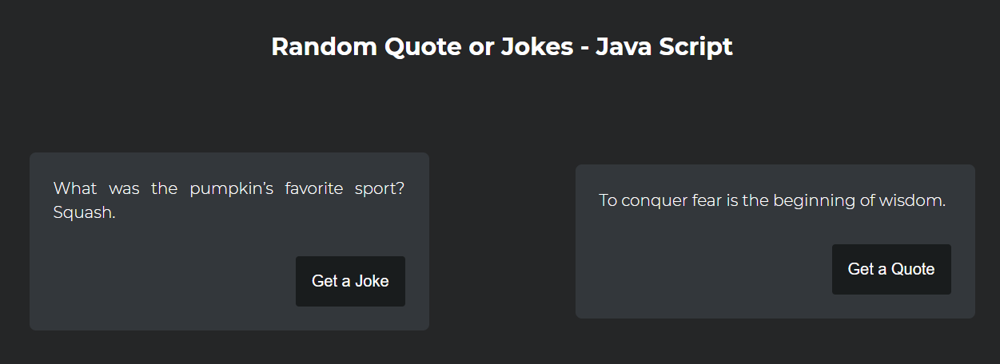

# Random Jokes or Quote- JavaScript

Self revising certain concepts of JS as part of #100daysofcoding

## Tech:

> Basic HTML,CSS & JS .

## About the repo:

Using an API we can fetch some random Quotes / Jokes

> Check out the [Link](https://shijoshaji.github.io/random_Quote_or_Joke/)

## Screen Shot:

